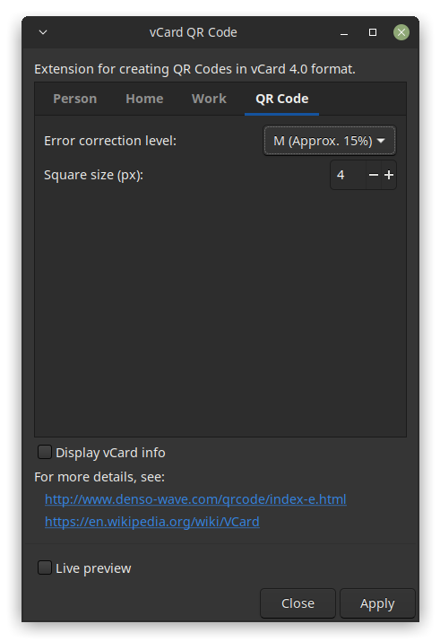

# vCard QR Code Creator Inkscape extension


This Inkscape extension creates **QR codes** that contain your personal **business card information** in a standardized machine readable format ([vCard 4.0](https://en.wikipedia.org/wiki/VCard)), so you can **quickly share your info** by just letting another person scan your QR code with their mobile phone, e.g. when meeting people at a conference or business fair.

It contains fields for both **private** and **business** information.

All fields except for the **name field** are optional. Consider creating different codes for private and business events.

The extension has been tested with and developed for Inkscape 1.2.

Inspired by [Sergey Vedernikov's vCard QR Code generator extension](https://inkscape.org/~sergey15th13/%E2%98%85vcard-qr-code-generator).

## Installation

### Dependencies
Ensure that you have the required python packages installed:
* pip install inkex
* pip install validators
* pip install daal4py
* pip install scipy
* pip install numba
* pip install numpy

### Inkscape Setup
Copy the files in the src/ directory into the user extensions
directory (see 'Inkscape Preferences > System' for the exact location)
and relaunch Inkscape.

### Setup on Windows 

On windows you might need to updated the [python interpretor for inkscape](https://inkscape.gitlab.io/extensions/documentation/authors/interpreters.html) to point to your locally installed version. You can do this by:
* Opening Inkscape and going to Tools -> Preferences -> System
* Find the location of the preferences.xml file in the "User preferences" entry. This probably will looks something like this C:\Users\\(UserName)\AppData\Roaming\inkscape\preferences.xml.
* Open this file and find the group element with the id extensions. Add the attribubute python-interpreter with the full path to your python.exe. For example:
```xml
  <group
     id="extensions"
     python-interpreter="C:\ProgramData\Anaconda3\python.exe"
```

If you run into issues with numpy you might need to uninstall and reinstall it.

## Usage

* In Inkscape, you can find the extension in **Extensions > Render > Barcode > vCard QR Code**.
* The 'Full name' field is the only required field.
* Each field has an **info text** with an example which appears when you hover above it with the mouse cursor.
* **Formatting** is important! Email addresses, links to images / GPG keys and your birthday must be formatted correctly.
* The extension will automatically determine the correct QR code size. As **QR codes have a limited size** (less than 3000 characters), it may happen that the extension tells you that the text is too long. You can then reduce the error correction level to gain capacity and / or shorten/remove some of your data from the form.
* When you have entered all the information that you would like to appear in your vCard, click on **'Apply'**. This will add a QR code to your document.
* **Test** the QR code with your phone's QR code scanner.
* **Use**: print it on your business card, share it on your website, copy it to your phone, …

## Screenshots





## License

Main code: GPLv2 or higher
Validation code for email addresses and urls: MIT
